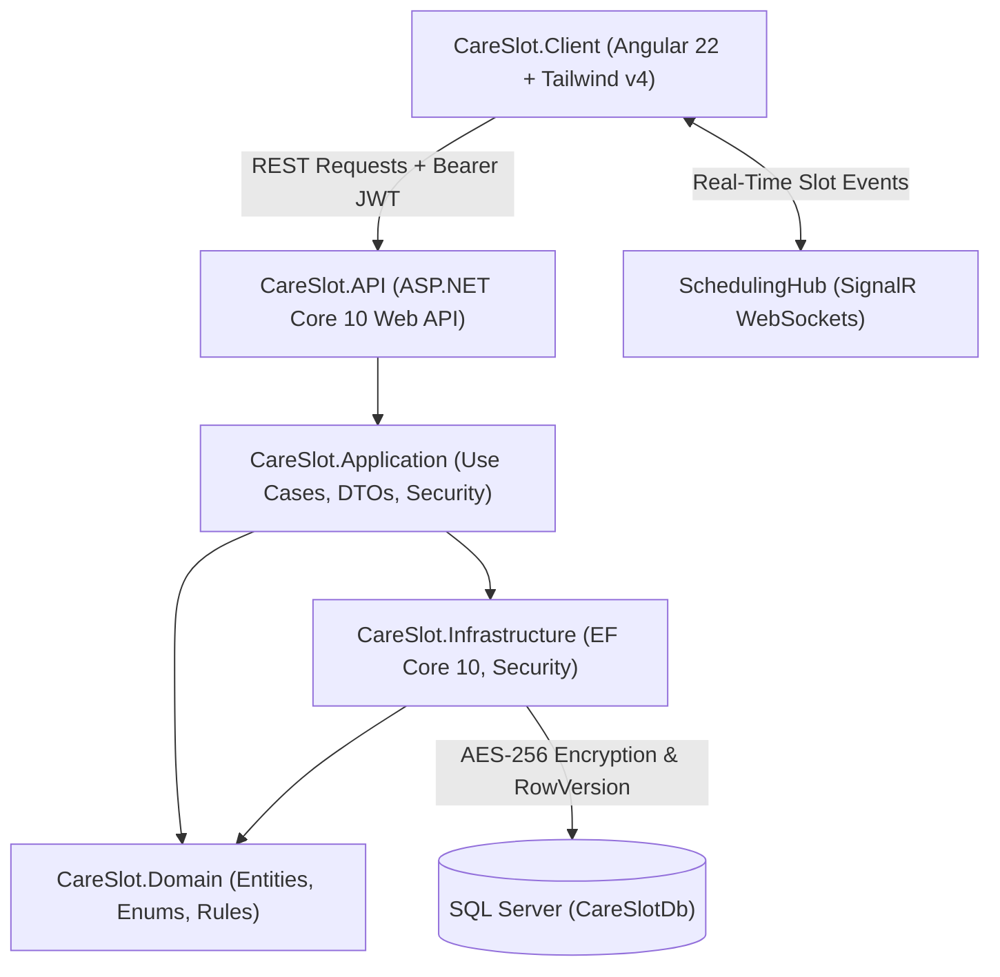
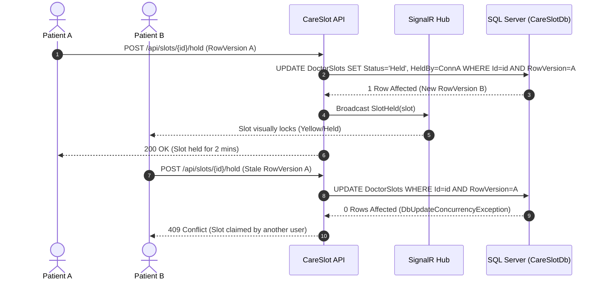
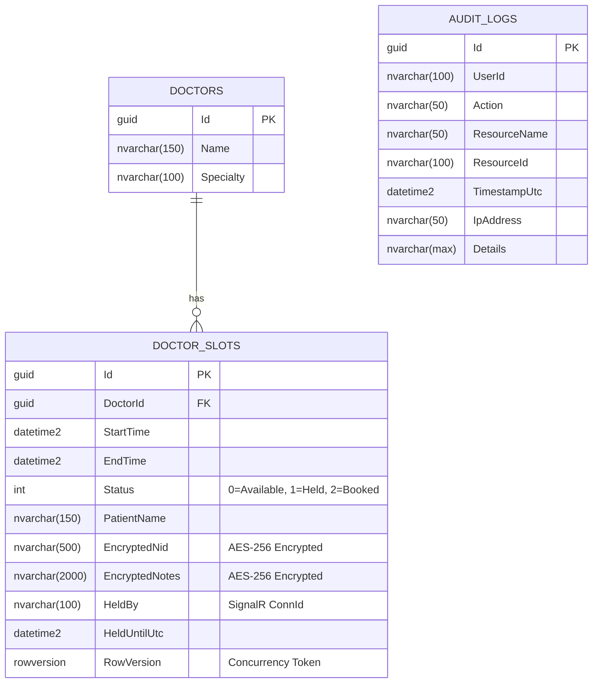

# CareSlot 🩺

[](https://dotnet.microsoft.com/)
[](https://angular.dev/)
[](https://tailwindcss.com/)
[](https://www.microsoft.com/sql-server)
[](https://dotnet.microsoft.com/apps/aspnet/signalr)
[](#hipaa--data-privacy-considerations)

**CareSlot** is a high-reliability, HIPAA-aware clinical appointment scheduling and audit system built as a clean **Modular Monolith** using **.NET 10 Web API** and an **Angular 22 Zoneless Single-Page Application**.

The system solves high-concurrency clinical race conditions (eliminating double-booking using a 2-phase optimistic locking protocol), enforces strict Role-Based Access Control (RBAC), and complies with HIPAA data security standards through AES-256 column encryption at rest and an immutable audit log.

---

## 🏗️ Architecture Overview

CareSlot is engineered following **Clean Architecture** and **Domain-Driven Design (DDD)** principles, separating concerns across five focused projects:



### Layer Breakdown

| Project | Responsibility | Key Components |
| :--- | :--- | :--- |
| **`CareSlot.Domain`** | Core clinical entities, enums, and domain invariants with zero third-party dependencies. | `Doctor`, `DoctorSlot`, `AuditLog`, `SlotStatus`. |
| **`CareSlot.Application`** | Business orchestration, interfaces, DTOs, and RBAC role definitions. | `ISchedulingService`, `IJwtTokenService`, `ICurrentUserService`, `Roles`. |
| **`CareSlot.Infrastructure`** | Database persistence, column encryption converters, audit trail enforcement, and JWT token issuing. | `CareSlotDbContext`, `AesEncryptionConverter`, `SchedulingService`, `JwtTokenService`. |
| **`CareSlot.API`** | REST controllers, SignalR WebSocket hub, authentication/authorization pipelines, and OpenAPI documentation. | `SlotsController`, `DoctorsController`, `AuthController`, `AuditController`, `SchedulingHub`. |
| **`CareSlot.Client`** | Standalone Angular 22 client with reactive signals, Tailwind CSS v4 styling, and real-time state synchronization. | `CalendarComponent`, `LoginComponent`, `ManageDoctorsModalComponent`, `ManageAvailabilityModalComponent`, `AuditDrawerComponent`. |

---

## ⚡ Concurrency & Double-Booking Prevention

In clinical environments, multiple patients or administrators frequently attempt to claim the exact same high-demand appointment slot simultaneously. CareSlot implements a **Two-Phase Optimistic Concurrency Protocol**:



### 1. Phase 1: Temporary Hold (Optimistic Locking)
- When a user clicks an `Available` slot, the client sends a `HoldSlot` request containing the slot's current base64 `RowVersion`.
- The backend checks whether the slot is currently `Available` or whether an existing hold has expired.
- If valid, the slot transitions to `Held` with a 2-minute deadline (`HeldUntilUtc = UtcNow.AddMinutes(2)`), locking it with the caller's unique SignalR connection ID.
- The change is instantly broadcast to all connected clients via `SignalR`, disabling the slot across all active browser windows.

### 2. Phase 2: Booking Confirmation & Concurrency Tokens
- When the booking form is submitted, the slot's SQL Server `ROWVERSION` concurrency token is evaluated inside an atomic transaction.
- If another process altered the record in the millisecond before submission, EF Core throws a `DbUpdateConcurrencyException`, returning **HTTP 409 Conflict** to completely prevent double bookings.

---

## 🛡️ HIPAA & Data Privacy Considerations

CareSlot is architected to address HIPAA Security Rule (§ 164.312) specifications:

### 1. Column-Level Encryption at Rest (AES-256)
- Sensitive Protected Health Information (PHI) — specifically patient National IDs (`EncryptedNid`) and clinical consultation notes (`EncryptedNotes`) — are never stored in plaintext on disk.
- An EF Core `AesEncryptionConverter` performs authenticated AES-256 encryption before writing to SQL Server and transparently decrypts the ciphertext only when an authorized clinician accesses the dossier.

### 2. Append-Only Immutable Audit Trail
- Every clinical interaction records an immutable entry in the `AuditLogs` table, tracking:
  - `UserId` (Clinical identifier or patient account ID)
  - `Action` (`SLOT_HELD`, `SLOT_BOOKED`, `PHI_ACCESSED`, `DOCTOR_CREATED`, `AVAILABILITY_CONFIGURED`, etc.)
  - `ResourceName` and `ResourceId`
  - `IpAddress` and `TimestampUtc`
- **Database-Level Immutability**: `CareSlotDbContext.SaveChangesAsync()` intercepts modifications and explicitly throws an exception if any query attempts to `UPDATE` or `DELETE` records from `AuditLogs`.

### 3. Minimum Necessary Rule (§ 164.314)
- **Zero Cleartext PHI in Logs**: Serilog structured logging masks patient identifiers, ensuring diagnostic server logs contain zero unencrypted PHI.
- **Role Isolation**: Customers can only view their own confirmed bookings. Clinical notes and National IDs are strictly restricted to verified `Doctor` and `Admin` tokens.

---

## 👥 Role-Based Access Control (RBAC) Matrix

The system enforces three distinct personas with dedicated workflows:

| Capability / Action | Customer | Doctor | Admin |
| :--- | :---: | :---: | :---: |
| **Browse Weekly Available Slots** | ✅ | ❌ *(Tailored view)* | ✅ |
| **Self-Service Appointment Booking** | ✅ | ❌ *(Blocked by policy)* | ✅ *(Proxy booking)* |
| **Create Patient Account (Self-Registration)** | ✅ | ❌ *(Staff provisioned)* | ❌ *(Staff provisioned)* |
| **View Scheduled Appointments** | Own visits | Own consultations | All clinicians |
| **Inspect Patient Clinical Dossier (Decrypted PHI)** | ❌ | ✅ | ✅ |
| **Manage Own Availability & Working Hours** | ❌ | ✅ | ✅ |
| **Manage Colleague Availability** | ❌ | ❌ *(403 Forbidden)* | ✅ |
| **Manage Clinicians (Add, Edit, Delete Doctor)** | ❌ | ❌ | ✅ |
| **Inspect HIPAA Audit Trail Drawer** | ❌ | ❌ | ✅ |

### Tailored Role Experiences:
- **Doctor Experience**: Doctors do not see an empty booking calendar. Instead, they receive a **Clinical Command Center** showing their active consultations, quick metric cards (*Total*, *Today*, *Upcoming*), decrypted patient dossiers, and a prominent **"Manage Availability"** button to adjust shift hours and clear slots for time-off.
- **Customer Experience**: Patients receive a frictionless self-service calendar with real-time slot locking, instant hold timers, and appointment confirmations.
- **Admin Experience**: Administrators retain clinical oversight with clinician CRUD, practice-wide scheduling controls, and real-time HIPAA compliance monitoring.

---

## 🗄️ Database Schema

The database schema is kept ultra-lean, comprising three normalized tables:



---

## 🚀 Quickstart Guide

### Prerequisites
- [.NET 10 SDK](https://dotnet.microsoft.com/download/dotnet/10.0)
- [Node.js v20+](https://nodejs.org/) and `npm`
- [SQL Server](https://www.microsoft.com/sql-server) (LocalDB, Express, or Standard instance)

---

### 1. Backend Setup (`CareSlot.API`)

1. Clone the repository:
   ```bash
   git clone https://github.com/abdulla30r/CareSlot.git
   cd CareSlot
   ```

2. Configure database connection string in `CareSlot.API/appsettings.json`:
   ```json
   "ConnectionStrings": {
     "DefaultConnection": "Server=localhost;Database=CareSlotDb;Trusted_Connection=True;TrustServerCertificate=True;"
   }
   ```

3. Run migrations and start the Web API:
   ```bash
   dotnet run --project CareSlot.API --launch-profile http
   ```
   The backend will start listening at:
   - **API & Swagger**: `http://localhost:5232/swagger`

---

### 2. Frontend Setup (`CareSlot.Client`)

1. Navigate to the client directory and install dependencies:
   ```bash
   cd CareSlot.Client
   npm install
   ```

2. Launch the development server:
   ```bash
   npm start
   ```
   The Angular application will be served at:
   - **Client Portal**: `http://127.0.0.1:4200`
   *(All `/api` and `/hubs` requests are automatically reverse-proxied to port `5232` via `proxy.conf.json`).*

---

### 3. Visual Studio Multiple Startup Projects

If developing in Visual Studio 2022 / 2026:
1. Open the solution file: `CareSlot.slnx`.
2. Right-click the solution $\to$ **Configure Startup Projects...**
3. Select **Multiple Startup Projects**:
   - Set `CareSlot.API` $\to$ **Start**
   - Set `CareSlot.Client` $\to$ **Start**
4. Press <kbd>F5</kbd> to launch both services concurrently with full debugging.

---

## 🧪 Demo Personas & Credentials

The system includes pre-seeded demonstration credentials accessible via 1-click login on the Sign-In page:

| Persona | Role | Email | Password | Primary Workflow |
| :--- | :--- | :--- | :--- | :--- |
| **John Doe** | `Customer` | `patient@careslot.local` | `Patient123!` | Self-service booking, hold locks, patient portal. |
| **Dr. Sarah Jenkins** | `Doctor` | `doctor@careslot.local` | `Doctor123!` | Inspect consultations, decrypt dossiers, manage shifts. |
| **Marcus Brody** | `Admin` | `admin@careslot.local` | `Admin123!` | Clinician CRUD, practice schedule, HIPAA audit trail. |

*(New patient accounts can also be created dynamically via the "Create Account" tab).*

---

## 📡 Key API Endpoints

| Method | Endpoint | Authorization | Description |
| :--- | :--- | :--- | :--- |
| `POST` | `/api/auth/login` | Public | Authenticates credentials and issues signed JWT. |
| `POST` | `/api/auth/register` | Public | Self-registration strictly restricted to Customer role. |
| `GET` | `/api/doctors` | Authenticated | Lists all attending medical clinicians. |
| `POST` | `/api/doctors` | `Admin` | Provisions a new clinician in the clinic directory. |
| `POST` | `/api/doctors/{id}/availability` | `Doctor`, `Admin` | Configures custom working hours, shifts, and slot duration. |
| `DELETE`| `/api/doctors/{id}/availability/unbooked` | `Doctor`, `Admin` | Clears open unbooked slots for scheduled time-off. |
| `GET` | `/api/doctors/{id}/appointments` | `Doctor`, `Admin` | Returns booked consultations for a specific clinician. |
| `POST` | `/api/slots/{id}/hold` | `Customer`, `Admin` | Initiates 2-minute optimistic hold lock on an open slot. |
| `POST` | `/api/slots/{id}/book` | `Customer`, `Admin` | Confirms patient booking and encrypts PHI at rest. |
| `GET` | `/api/slots/{id}/details` | `Doctor`, `Admin` | Decrypts and returns confidential clinical dossier. |
| `GET` | `/api/audit` | `Admin` | Fetches chronological immutable HIPAA audit trail. |

---

## 📄 License
This project is licensed under the MIT License — see the [LICENSE](LICENSE) file for details.
